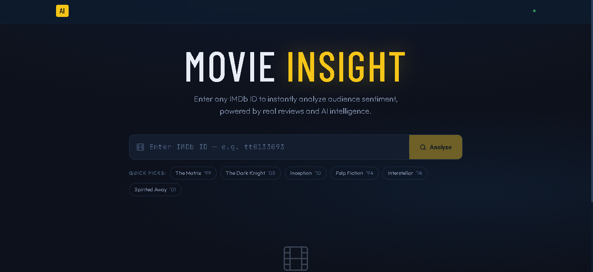
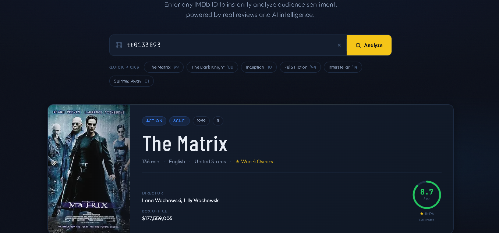
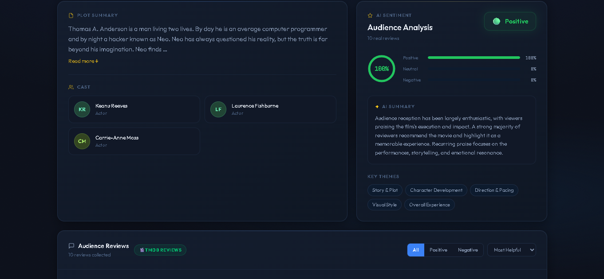
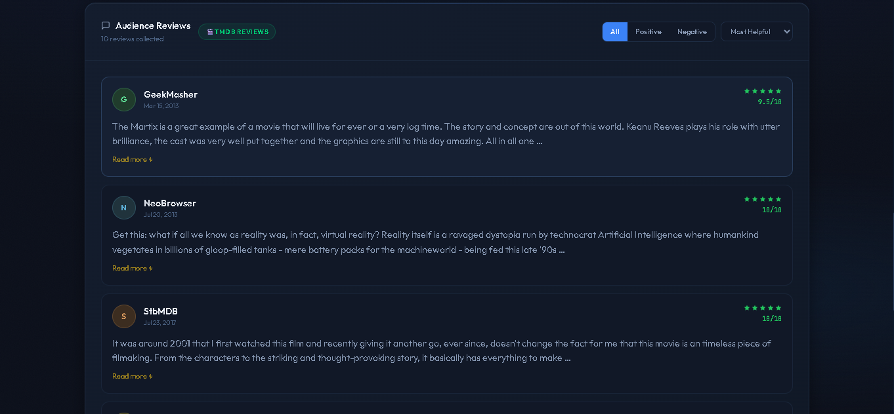

# 🎬 AI Movie Insight Builder

A **production-ready full-stack Next.js application** that analyzes any movie using its **IMDb ID**.
The app fetches **real audience reviews** and uses **Google Gemini AI** to generate intelligent **sentiment summaries and key themes** from viewer feedback.

🌐 **Live Demo:**
https://ai-movie-insight-builder-sage.vercel.app/


---

## 📸 Screenshots

### Home Page


### Movie Retrieval


### Cast & Review Section


### Audience Reviews


---

# ✨ Features

### 🎯 IMDb ID Input

Users can enter a valid IMDb movie ID to instantly fetch movie insights. Example shortcuts allow quick testing.

### 🎥 Movie Details

Retrieves movie information such as:

* Poster
* Title
* Release year
* IMDb rating
* Cast
* Plot summary

using the **OMDb API**.

### 🗣 Audience Reviews

Fetches up to **50 real audience reviews** from **TMDb** to analyze public opinion about the movie.

### 🤖 AI Sentiment Analysis

Uses **Google Gemini AI** to generate:

* A **3–5 sentence sentiment summary**
* A **sentiment label** (Positive / Mixed / Negative)
* **Key discussion themes** extracted from reviews

### 🧠 Heuristic Fallback

If the Gemini API key is not configured, the system automatically switches to a **lexical sentiment analysis**, ensuring the application remains fully functional.

### ⚡ Skeleton Loading

Smooth **shimmer loading placeholders** are displayed while movie data and reviews are being fetched.

### 🎞 Smooth Animations

Uses **Framer Motion** for clean UI transitions and animated content reveals.

### 📱 Responsive Design

Mobile-first design built with **Tailwind CSS**, ensuring the application works across all screen sizes.

### 🛡 Error Handling

User-friendly error messages for:

* Invalid IMDb IDs
* API failures
* Missing data

---

# 🧠 What This Project Demonstrates

This project demonstrates:

* Full-stack **Next.js application development**
* Integration with **multiple external APIs**
* **AI-powered sentiment analysis**
* Clean **component-based React architecture**
* **TypeScript-based type safety**
* Modern **UI/UX with Tailwind CSS**
* Production deployment using **Vercel**

---

# 🗂 Project Structure

```
/
├── app/
│   ├── components/
│   │   ├── MovieInput.tsx
│   │   ├── MovieCard.tsx
│   │   ├── CastList.tsx
│   │   ├── SentimentSummary.tsx
│   │   ├── ReviewList.tsx
│   │   ├── SkeletonLoader.tsx
│   │   └── ErrorDisplay.tsx
│
│   ├── lib/
│   │   ├── types.ts
│   │   ├── fetchMovie.ts
│   │   ├── fetchReviews.ts
│   │   └── sentimentAnalyzer.ts
│
│   ├── layout.tsx
│   └── page.tsx
│
├── pages/api/
│   ├── movie.ts
│   └── reviews.ts
│
├── styles/
│   └── globals.css
│
├── screenshots/
├── __tests__/
│   └── sentiment.test.ts
│
└── README.md
```

---

# 🚀 Setup Instructions

## 1️⃣ Clone the repository

```
git clone https://github.com/43vaibhav/ai-movie-insight-builder.git
cd ai-movie-insight-builder
```

---

## 2️⃣ Install dependencies

```
npm install
```

---

## 3️⃣ Configure environment variables

Create a `.env.local` file in the root directory.

```
OMDB_API_KEY=your_omdb_api_key
TMDB_API_KEY=your_tmdb_api_key
GEMINI_API_KEY=your_gemini_api_key
```

---

## 4️⃣ Run the development server

```
npm run dev
```

Open:

```
http://localhost:3000
```

---

## 5️⃣ Run tests

```
npm test
```

---

# 🔑 Environment Variables

| Variable       | Required | Description                   |
| -------------- | -------- | ----------------------------- |
| OMDB_API_KEY   | Yes      | Fetch movie details           |
| TMDB_API_KEY   | Yes      | Fetch audience reviews        |
| GEMINI_API_KEY | Optional | Enables AI sentiment analysis |

If Gemini is not provided, the app automatically uses **heuristic sentiment analysis**.

---

# 🛠 Tech Stack

**Frontend**

* Next.js 14
* React
* TypeScript
* Tailwind CSS
* Framer Motion

**Backend**

* Next.js API Routes
* Node.js

**APIs**

* OMDb API
* TMDb API
* Google Gemini AI

**Testing**

* Vitest

**Deployment**

* Vercel

---

# 🌐 Deployment

This project is deployed on **Vercel**.

Live application:

https://ai-movie-insight-builder-sage.vercel.app/

---

# 📝 License

MIT License
